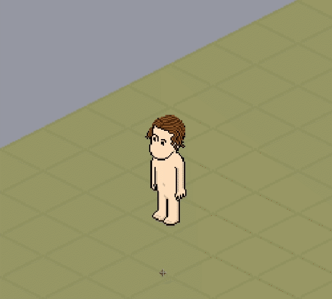
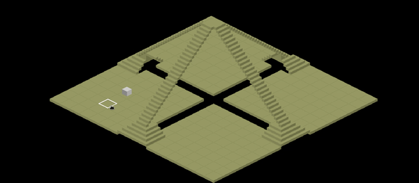

# Open Hotel

Check out the [Demo](https://open-hotel-demo.netlify.com/)

Open Hotel is an open-source project that aims to build a brand new canvas-drawn Habbo Remake.

## Walking

## Stairs

## Roadmap

- [x] Build floor structure
- [x] Create a walkable character
- [x] Build stairs in the rooms
- [x] Provide live demo
- [x] Provide a character instead of a cube
- [x] Build Walls
- [ ] Create clothing system
- [ ] Create floor-mobis basic system
- [ ] Create wall-mobis basic system

## Contributors

Want to become a contributor? Read our [contribution guide](./CONTRIBUTING.md)
